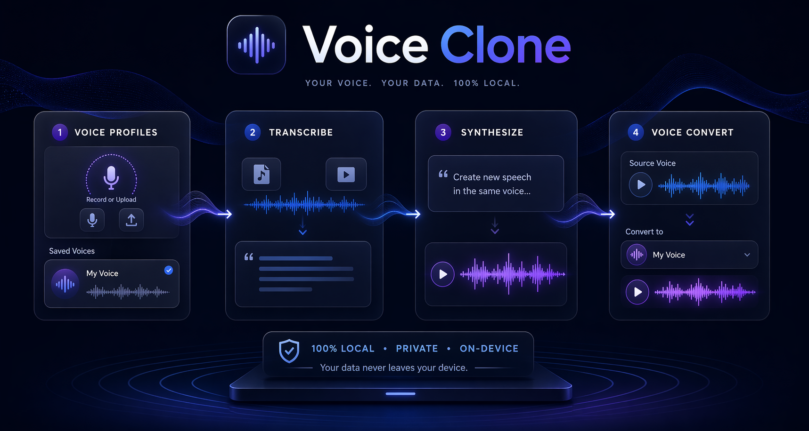

# Voice Clone

Local-first voice cloning studio built with a FastAPI backend and a Next.js frontend. It lets you create reusable voice profiles, transcribe audio and video with faster-whisper, synthesize new speech with Qwen3-TTS, and convert source audio into a saved voice style without leaving your machine.



## Why This Project Exists

Most voice tools are either API-first, cloud-only, or fragmented across separate scripts for transcription, reference management, and synthesis. Voice Clone packages those workflows into one local studio:

- Create and reuse voice profiles from reference audio plus transcript pairs
- Transcribe audio or video with subtitle export support
- Generate brand-new speech in a saved voice style
- Convert an existing recording into another saved voice
- Keep audio, transcripts, and generated outputs on your own machine

## What It Does

- `Voice profiles`: save a reusable voice as `saved_voices/<name>.wav` + `saved_voices/<name>.txt`
- `Speech synthesis`: generate target text in a reference voice with speed, pitch, and emotion controls
- `Transcription`: upload audio or video and receive a cleaned transcript plus timed segments for `.srt` and `.vtt`
- `Voice conversion`: transcribe source media, then re-synthesize it in a saved voice profile
- `Streaming UX`: long-running jobs report progress through Server-Sent Events instead of blocking the UI
- `Local runtime`: device auto-detection supports CUDA, Apple Silicon MPS, and CPU fallback

## Architecture

## Demo Flow

1. Open the web UI at `http://localhost:3000`
2. Create a voice profile by recording or uploading a reference clip and saving its transcript
3. Use the `Synthesize` tab to generate fresh speech in that voice
4. Use the `Transcribe` tab to turn audio or video into text and subtitle files
5. Use the `Voice Convert` tab to transcribe source media and re-speak it in a saved voice

## Tech Stack

| Layer | Stack |
| --- | --- |
| Frontend | Next.js 16, React 19, TypeScript, Tailwind CSS 4 |
| Backend | FastAPI, Uvicorn, Python |
| TTS | Qwen3-TTS |
| ASR | faster-whisper |
| Audio | librosa, soundfile, browser `MediaRecorder` |

## Core Design Decisions

### 1. Model mutual exclusion

Qwen3-TTS and faster-whisper are heavy enough to contend for memory, especially on Apple Silicon. The backend keeps this under control with `backend/services/model_manager.py`, which gates model access behind an `asyncio.Lock`. All ASR and TTS work goes through `with_asr()` or `with_tts()`.

### 2. SSE over WebSocket

The long-running endpoints stream progress using Server-Sent Events:

- `POST /api/transcribe`
- `POST /api/generate`
- `POST /api/convert`
- `POST /api/convert/finalize`

The frontend consumes them with `fetch()` and `ReadableStream`, not `EventSource`, because the requests carry multipart form bodies.

### 3. Serialized audio delivery

Synthesized audio is returned in the final SSE payload as base64-encoded WAV, then converted into a browser `Blob URL` client-side. That avoids a second fetch just to retrieve generated audio.

### 4. File-pair voice profiles

There is no database. A voice profile is simply:

- `saved_voices/<name>.wav`
- `saved_voices/<name>.txt`

That keeps the project inspectable, hackable, and easy to back up.

## Repository Layout

```text
Voice-Clone/
├── app.py                    # legacy Gradio app kept for reference
├── start.sh                  # starts backend + frontend with health checks
├── saved_voices/             # reusable voice profiles (<name>.wav + <name>.txt)
├── generated/                # persisted generated outputs and metadata
├── backend/
│   ├── main.py               # FastAPI app, CORS, static mounts, router registration
│   ├── config.py             # paths, model IDs, device detection, ASR choices
│   ├── routers/
│   │   ├── voices.py         # voice CRUD endpoints
│   │   ├── inference.py      # transcribe, generate, convert, subtitles, unload
│   │   ├── history.py        # generated output history endpoints
│   │   └── status.py         # model/device/runtime status endpoint
│   ├── services/
│   │   ├── model_manager.py  # async-safe TTS/ASR loading and mutex
│   │   ├── tts_service.py    # Qwen3-TTS wrapper
│   │   ├── asr_service.py    # faster-whisper wrapper
│   │   └── history.py        # output persistence
│   └── utils/
│       ├── audio.py          # upload normalization and temp-file handling
│       ├── text.py           # transcript cleanup and formatting
│       ├── subtitles.py      # SRT / VTT builders
│       └── errors.py         # domain-specific API errors
└── frontend/
    ├── src/app/              # layout, page shell, theme tokens
    ├── src/components/       # panels and shared UI primitives
    ├── src/hooks/            # SSE, recorder, status, settings hooks
    ├── src/lib/              # typed API client and helpers
    └── src/types/            # shared TypeScript types
```

## Requirements

- Python `3.9+`
- Node.js `18+`
- macOS, Linux, or Windows subsystem environments capable of running the Python and Next.js stacks
- Enough free disk space for Qwen3-TTS plus whichever faster-whisper model you choose

First run downloads the selected model artifacts from Hugging Face.

## Quick Start

```bash
# 1. Create a Python environment
python3 -m venv venv
./venv/bin/pip install -r backend/requirements.txt

# 2. Install frontend dependencies
cd frontend
npm install
cd ..

# 3. Start the full app
./start.sh
```

Open:

- UI: `http://localhost:3000`
- API: `http://127.0.0.1:8000`
- API docs: `http://127.0.0.1:8000/docs`

## Manual Start

```bash
# Terminal 1
cd backend
../venv/bin/python -m uvicorn main:app --reload --port 8000

# Terminal 2
cd frontend
npm run dev
```

## Frontend Experience

The Next.js app exposes four main workflows:

- `Voice Profiles`: record or upload reference audio, transcribe or edit the transcript, and save reusable voices
- `Synthesize`: generate new speech from a reference voice profile
- `Transcribe`: upload media and export transcript, `.srt`, or `.vtt`
- `Voice Convert`: transcribe source media, then synthesize it using a saved voice profile

The visual system uses a dark glassmorphism style defined in `frontend/src/app/globals.css`.

## Backend API Overview

| Endpoint | Method | Purpose |
| --- | --- | --- |
| `/api/voices` | `GET` | list saved voices |
| `/api/voices` | `POST` | save a voice profile |
| `/api/voices/{name}` | `GET` | fetch voice transcript and audio URL |
| `/api/voices/{name}` | `DELETE` | delete a voice profile |
| `/api/transcribe` | `POST` | transcribe audio or video with progress SSE |
| `/api/subtitles` | `POST` | convert transcript segments to `.srt` or `.vtt` |
| `/api/generate` | `POST` | synthesize text from a reference clip |
| `/api/convert` | `POST` | transcribe and re-synthesize source media |
| `/api/convert/finalize` | `POST` | synthesize from an edited reviewed transcript |
| `/api/history` | `GET` | list generated output history |
| `/api/history/{id}` | `DELETE` | delete one generated item |
| `/api/history` | `DELETE` | clear all generated history |
| `/api/status` | `GET` | inspect loaded models, memory state, and device |
| `/api/unload` | `POST` | unload all models from memory |

## Runtime Behavior

### Device selection

At backend startup, `backend/config.py` chooses:

- `cuda:0` when CUDA is available
- `mps` on Apple Silicon when MPS is available
- `cpu` otherwise

TTS dtype and attention implementation are also selected from that same detection step.

### ASR model choices

The app currently exposes these faster-whisper sizes:

- `tiny`
- `base`
- `small`
- `medium`
- `large-v3`
- `turbo`

### Supported language choices in the UI

- `Auto`
- `en`, `ar`, `de`, `es`, `fr`, `it`, `ja`, `ko`, `pt`, `ru`, `zh`

### Long-text synthesis

Long text is chunked on sentence boundaries in `backend/services/tts_service.py` using `TTS_CHUNK_CHAR_LIMIT`, which defaults to `280` characters. Chunks are synthesized separately and stitched together.

## Storage Model

### Saved voice profiles

Saved voices live in `saved_voices/` and are served back to the UI through:

- `/voices-static/<name>.wav`

### Generated outputs

Generated or converted files are persisted to `generated/` as:

- `<timestamp>_<kind>_<voice>.wav`
- `<timestamp>_<kind>_<voice>.json`

The JSON sidecar stores metadata such as text, voice name, emotion, speed, pitch, and playback URL.

## Privacy

This project is designed for local use. The application stores voice references, transcripts, and generated audio on disk inside the repository workspace. Model downloads happen from external model hosts on first run, but inference itself is performed locally.

If you plan to demo the project publicly, avoid committing real user voice samples or sensitive transcripts into `saved_voices/` or `generated/`.

## Troubleshooting

### Port conflicts

- Backend defaults to `8000`
- Frontend defaults to `3000`

If one is already occupied, either stop the conflicting process or start the services manually on different ports.

### Slow first run

The first request may take noticeably longer because models are being downloaded or loaded into memory.

### Memory pressure on laptops

If your machine becomes sluggish:

- use `tiny` or `base` for faster-whisper
- unload models via `POST /api/unload`
- avoid running large ASR and TTS jobs in parallel

### Weak cloning quality

Cloning quality depends heavily on the reference pair:

- clean reference audio helps
- the transcript should match the spoken audio exactly
- short noisy clips reduce fidelity

## Legacy App

The original Gradio app is still present in `app.py`. It uses the same `saved_voices/` storage layout and can be run independently if you want the older single-file interface.

```bash
./venv/bin/python app.py
```

## Launch Notes

If you are announcing the project publicly, the safest headline is:

`Local voice cloning studio with reusable voice profiles, transcription, subtitle export, and voice-to-voice conversion.`

That accurately matches the repository today without overselling cloud, auth, or deployment features that are not part of the current codebase.

## License

MIT
